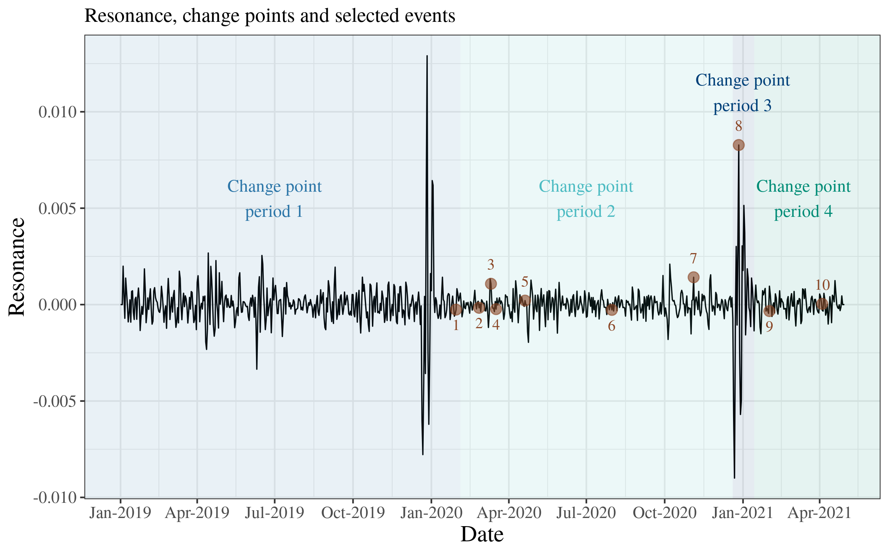

# Data Science exam
Exam project for Data Science S22 by Stine Nyhus Larsen &amp; Sara Møller Østergaard.

The work in this project relies on findings from a previous project done by the same authors. Code for the previous project can be found in the [emoDynamics repository](https://github.com/saraoe/emoDynamics).



## Abstract
In this paper, we investigate emotion dynamics on Danish Twitter before and during the COVID-19 pandemic. The analysis extends upon previous work where windowed relative entropy has been used to calculate information signals on emotion classification of tweets. Change point detection is applied to identify relevant time periods where the dynamics change. Relying on these windows, the varying dynamics of the system are examined. The results of the study indicate a stronger positive coupling between the entropy measures *resonance* and *novelty* during the COVID-19 pandemic. Moreover, visually different correlations of individual emotions are detected in the change point periods. The findings of the study suggest a change in the dynamics of emotions on Twitter before and after COVID-19 appeared in Denmark. We discuss the implications of the emotion dynamics during the periods and suggest further analysis using the emotion correlations. 

## Project Organization
The organization of the project is as follows:

```
├── data     
│   ├── idmdl                  <- information dynamics models
│   ├── summarized_emo         <- summarized emotion distributions
│   └── covid_event            <- data set with events related to COVID-19
├── src                        
│   ├── changepoint.py
│   ├── combine_df.py
│   └── covid_clean.py
├── analysis
│   ├── visualization.Rmd
│   └── linear_model.Rmd
├── datascience_paper.pdf      <- final paper
├── README.md                  <- The top-level README for this project.
└── requirement.txt            <- A requirements file of the required packages.
```

## Run code
To reproduce the results clone the repository and run the following commands
```
pip install -r requirements.txt
```
```
python src/combine_dfs.py  --dynamics data/idmdl/tweets_emo_date_W3.csv --timeline data/covid_events/timeline_covid.xlsx --owid data/covid_events/owid-covid-data.csv
```
To reproduce the analysis of the data run code in ```analysis/linear_models.Rmd``` and to obtain the visualizations run ```analysis/visualizations.Rmd```. 
